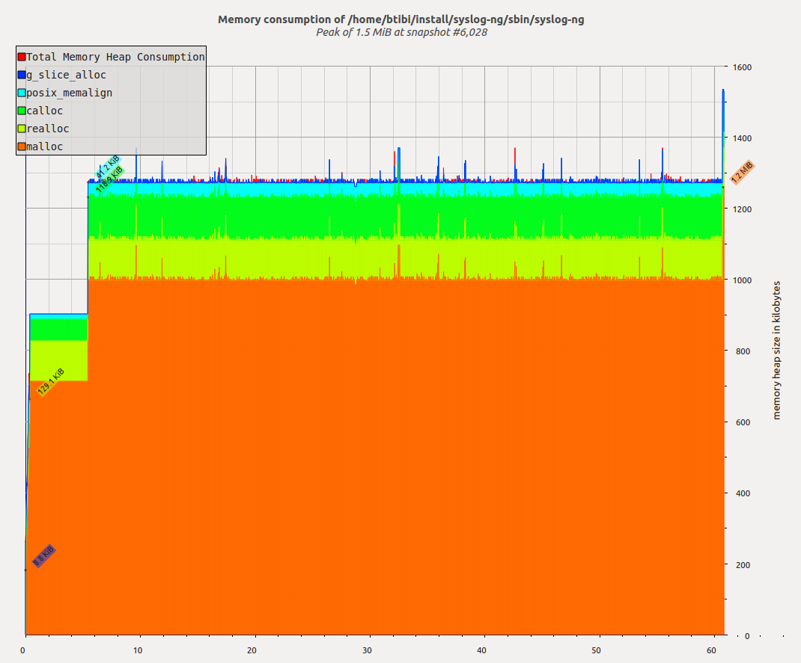

# Preparation

I suppose you have already cloned syslog-ng into a local repository and you
have all tools and libraries installed to compile syslog-ng.

## Creating debug builds

You need to have debug symbols included in syslog-ng in order to debug it
"efficiently". Step into your local clone and type the following commands:

```
$ ./autogen.sh
$ mkdir build
$ cd build
$ ../configure --enable-debug
$ make
$ sudo make install
```

The point is to pass the `--enable-debug` parameter to the `configure` script.

These commands will create a debug build under the `build` directory and
install syslog-ng under a system specific directory. Installation will require
superuser prviliges. 

## Installing and running without superuser privileges

You may need to test syslog-ng but don't have superuser privileges. You can
install syslog-ng into a custom location and run it without any privilege. This
solution is fine until you need to read from `/dev/log` or listen to ports
under 1024.

You can set the install location before the compilation process, just pass a
`--prefix=<the path where syslog-ng should be installed>` parameter to the
`configure` script.

```
$ ./autogen.sh
$ mkdir build
$ cd build
$ ../configure --enable-debug --prefix=$HOME/install/syslog-ng
$ make
$ make install
```

This way `make install` won't need superuser privileges and you can have
multiple versions from syslog-ng on your computer.

# Finding bugs

Unfortunately every software has bugs and syslog-ng is not an exection. When
you report the problem to the developers they may need some extra information
to reproduce the issue in-house. In this section we introduce you to some frequently
used tools which may greatly simplify the bug hunting.

# Finding memory leaks

We suggest to use two tools to track down these problems. `Valgring` can detect
memory leaks and many other things, it's available on a lot of operating
systems but it greatly slows down syslog-ng. `heaptrack` is very convenient to
use, it's faster than `valgrind` but it isn't distributed as a binary package.
You also need a Linux with a decent C++11 compiler.

## Installing valgrind

On most platforms you can use the native package manager to install `valgrind`.
On Ubuntu Trusty you need to execute the following commmand:

```
$ sudo apt-get install valgrind
```

On CentOS 7 just execute:

```
# yum install valgrind
```

## Running syslog-ng under valgring

You can run syslog-ng under valgrind with the following command.

```
G_SLICE=always-malloc valgrind --leak-check=full <the path where syslog-ng is installed>/sbin/syslog-ng -F
```

You may use other paramters.  The `G_SLICE` environment variable makes the
result nicer, because you will get less false positive results. The developers
are interested in valgring's output log.

## Installing `heaptrack`

You will need a compiler with `C++11` support. At least GCC 4.8 or clang 3.3 is required.

### Ubuntu 14.04

In order to install heaptrack you have to compile it yourself. On Ubuntu Trusty
the steps are the following:

```
apt-get update -y
apt-get install -y cmake \
                   g++ \
                   git \
                   libboost1.55-dev \
                   libboost-iostreams1.55-dev \
                   libboost-program-options1.55-dev \
                   libdwarf-dev \
                   libunwind8-dev \
                   software-properties-common

git clone git://anongit.kde.org/heaptrack.git /home/heaptrack
mkdir /home/heaptrack/build
cd /home/heaptrack/build
cmake -DCMAKE_BUILD_TYPE=RelWithDebInfo ..
make && make install
```

You may use other paths, not just `/home/heaptrack`.

### CentOS 7

The steps are the following:

```
yum install -y epel-release
yum install -y cmake \
               gcc-c++ \
               git \
               boost-devel \
               boost-iostreams \
               boost-program-options \
               libdwarf-devel \
               libunwind-devel \
               make

git clone git://anongit.kde.org/heaptrack.git /home/heaptrack
mkdir /home/heaptrack/build
cd /home/heaptrack/build
cmake -DCMAKE_BUILD_TYPE=RelWithDebInfo ..
make && make install
```

You may use other paths, not just `/home/heaptrack`.

## Running syslog-ng with `heaptrack`

You can run syslog-ng with heaptrack with the following command:

```
heaptrack <the path where syslog-ng is installed>/sbin/syslog-ng -F
```

It will create a gzip file and after you stopped it, it prints something like this:

```
...
  heaptrack_print -l /home/milian/heaptrack.yourapp.12345.gz | less
```

The output of `heaptrack_print` gives you a lot of information about memory
leaks. The gzip file will be huge (some gigs or more) and `heaptrack_print`
will fully consume one of your CPUs when it runs. It's not so slow as valgrind
but you'll notice the decreased performance.

You may generate nice and useful graphs with `heaptrack`. Just run pass the
`-M` option to it. The massif-visualizer program can parse the output file and
create diagrams like this:



You can tune the result with `--massif-threshold` and `--massif-detailed-freq`.

If you are interested in heaptrack, you can find more information here:

http://milianw.de/blog/heaptrack-a-heap-memory-profiler-for-linux
